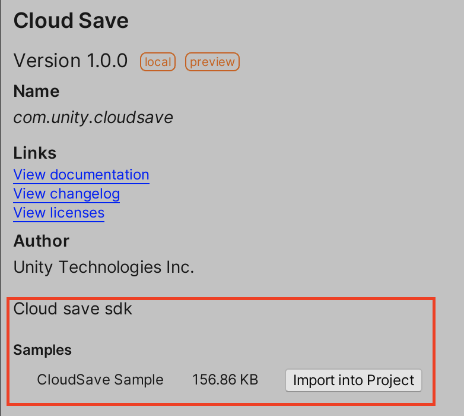
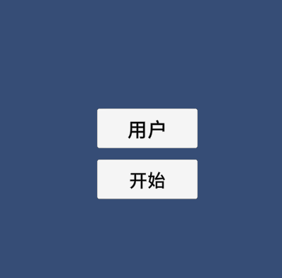
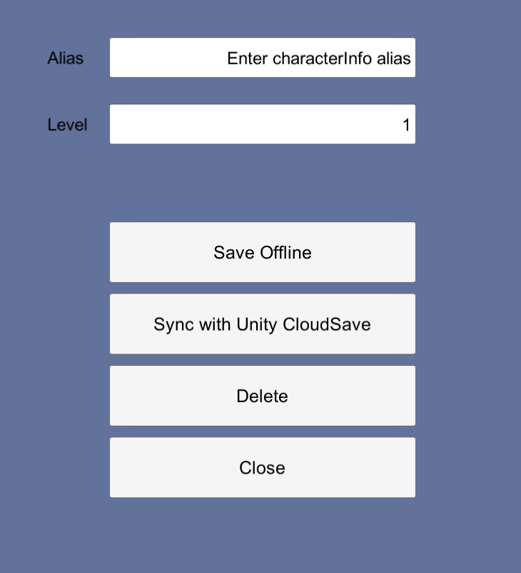

# 开始使用Unity CloudSave

## 依赖
+ 需要2019.2.x 以上的unity 版本
+ 注册unity账号且绑定手机号
+ CloudSave 需要依赖PlayerId ，在使用之前确保**Unity PlayerId SDK** 已经安装并配置。

## **安装 CloudSave sdk**


* 1.首先打开菜单**Window** ► **Package Manager**,勾选**Advanced ► Show preview packages**,搜索**package**并安装, 关键字为**Cloud Save**，并点击**Import into Project**导入**CloudSave Sample**

  


## **CloudSave Sample介绍**

* 2.导入后可在Assets目录下看到相应的Demo目录，打开Assets ► Samples ► Cloud Save ► version ► CloudSave Sample ► Assets ► Scenes 下的Sample即可。（可能需要导入TextMeshPro，选择导入即可）

*  3.点击**用户**，完成PlayerId 的登录。

      
  
 <br>**注意**：在该demo中点击**用户**按钮完成**PlayerId** 的登录之前，请确保连接上**PlayerId  Service**,并且已经配置好**Iddomain 和OAuth Client**，有关**PlayerId**,请参阅该**Package** 相应文档。

+ 4.点击**开始**，就可以使用该demo 然后进行data 保存。

  
  
  <br>在该demo 中，使用 ```OpenOrCreateDataset("CharacterInfo")``` 去创建  一个需保存的 DataSet, 并且实现```ISyncCallback接口```, 实现```OnConflict```等函数，有关具体的API使用方法，请参阅[```《Unity CloudSave用户手册》```](../Documentation~/Unity%20CloudSave用户手册.md)。
  
##  存储以及同步范例
  
  ```
      using UnityEngine.CloudSave;
  
     IDataset dataset = CloudSave.OpenOrCreateDataset("dataset_name");
     dataset.Put("key", "value");
     dataset.SynchronizeAsync(new DefaultSyncCallback()); 
     ...
     public class DefaultSyncCallback : ISyncCallback
    {
	   public bool OnConflict(IDataset dataset, IList<SyncConflict> conflicts)
	  {
		// Your code here
		return true;
	  }

	  public void OnError(IDataset dataset, DatasetSyncException syncEx)
	 {
		// Your code here
	 }

	 public void OnSuccess(IDataset dataset)
	 {
		// Your code here
	 }
   }
  ``` 
  如果需要更多技术支持，可通过[Unity Connect PlayerId支持小组](https://connect.unity.com/g/wan-jia-zhang-hao-xi-tong-player-id-cnshi-yong?tab=discussion)联系我们。
	
 
